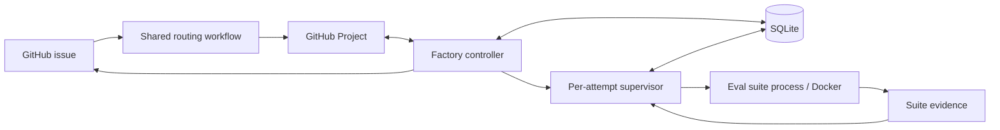

## Context

Iteration 1 connects GitHub requests to the existing `agent-evals` harness through a single local factory worker. This repository is a Python 3.12/uv scaffold; it has no controller implementation to migrate. The five specifications in `specs/` define the required behavior. This document defines architecture, interfaces, persistence, and runtime behavior. The accompanying `test-plan.md` defines verification and acceptance obligations.

The first supported work kind is `eval`; its first suite is `and-scene`. Requests vary Agent Runner and Agent Skills revisions and execution profiles. The deployed harness revision identifies the evaluation environment and is not another request variable. The factory controller and attempt supervisor run on the Mac. The existing suite launches one disposable Docker container per repetition attempt; three repetitions normally mean three sequential containers, not a container per repository or a global factory container. A recovery attempt uses a new container with the same repetition artifacts, while a controller restart leaves the existing container running. Host worktrees supply pinned source revisions independently of container lifetime. The suite already owns Docker execution, selected Skills installation, Claude quota handling, candidate branches/draft PRs, scoring, and human review.

The initial GitHub deployment has been provisioned and confirmed with Paul:

- Organization-owned Codagent Factory App, installed on all Codagent-AI repositories by Paul's choice. App identifiers, verified permissions, local key location, and Actions credential names are recorded in `setup/github-app.md`.
- Private [Codagent Project #1](https://github.com/orgs/Codagent-AI/projects/1), native Eval issue type, five Status columns, Owner/Refs/Verdict fields, and three board views. Type swimlanes and manual ordering were visually confirmed using temporary Eval and Task issues; both dummy issues were deleted.
- Field, option, view, and issue-type identifiers are recorded under `setup/`. Reuse these resources rather than creating replacements. The setup scripts are setup aids, not the implementation architecture.

Templates, labels, routing code and workflows, local service installation, and suite integration remain implementation work.

## Goals / Non-Goals

**Goals:**

- Keep GitHub request intent, SQLite execution history, and suite evidence distinct and reconcilable.
- Preserve running evaluations across controller restarts, prevent overlapping execution, and resume interrupted work within the approved retry budget.
- Keep scheduling and recovery independent of Codagent names, eval fields, scoring, and suite commands.
- Deliver meaningful issue activity and results durably, including usable human-review commands.
- Use explicit deployment configuration and pinned worktrees so queued continuations do not silently change their inputs.

**Non-goals:**

Additional work kinds or suites, concurrency greater than one, distributed workers, a remote database, interchangeable providers, a dynamic plugin loader, a general workflow language, baseline comparison, automatic human judging, PR merging, automatic artifact cleanup, and interpretation of every possible board gesture. Detailed tests, acceptance procedures, and implementation task breakdowns are separate artifacts.

## Approach

### Components and boundaries

Use one Python package with a small set of modules and explicit data records. The controller and per-attempt supervisor are different operating-system processes from that same package, not separate deployed services.

| Component | Responsibility | Does not own |
|---|---|---|
| Configuration | Load and validate shared deployment and local machine TOML; resolve logical field mappings | Secrets embedded in public configuration |
| GitHub client | App authentication, `gh api` calls, pagination, issue/Project reads and mutations | Admission or evaluation policy |
| Routing | Match configured source/marker rules, check authors, add Project items, initialize fields, handle closure | Local execution or SQLite |
| Controller | Poll, reconcile, select work, apply admission controls, manage claims, deliver reports | Suite command details or scoring |
| Store | Short SQLite transactions, claim/run records, controls, reporting progress | Suite evidence files |
| Supervisor | Own one attempt's process observation, progress accounting, timers, cancellation, and terminal record | Queue selection or starting the next repetition |
| Eval handler | Parse eval requests, freeze settings, enumerate repetitions, aggregate suite outcomes | Generic scheduling or process ownership |
| And-scene integration | Readiness, command construction, progress/outcome interpretation, resume and review command | Another evaluator or independent scoring rules |

Suggested package areas are `config`, `github`, `routing`, `controller`, `store`, `supervisor`, `work_kinds/eval`, and `suites/and_scene`. Use Python protocols and dataclasses with a static registry containing only the implementations shipped in iteration 1. Adding another kind or suite requires an implementation of the relevant interface, not changes throughout the controller and not configuration alone.



### Interface contracts

Keep the generic core's records small and explicit:

| Contract | Contents |
|---|---|
| `RequestSnapshot` | Issue and item identities, source repository, author permission, parsed request identity, observed fields and closure state |
| `FrozenSpec` | Work-kind-owned versioned JSON; enough accepted input and provenance to reproduce every work unit |
| `WorkUnit` | Stable opaque unit key and evidence location; the eval handler uses repetition numbers |
| `ExecutionPlan` | Argument vector, working directory, allowed environment and credential-file references, progress sources, ownership hints, resume mode |
| `Observation` | Verified process/container state, progress changes, bounded quota wait, available result, diagnostic reason |
| `AttemptResult` | Execution disposition, retry/quota classification, timestamps and evidence references, opaque work-kind result details |
| `ClaimPresentation` | Desired logical board state, display fields, stable activity events and result comment content |

A work-kind handler supplies request parsing/validation, freezing, the next unfinished unit, and claim presentation/aggregation. The eval handler delegates suite readiness, execution planning, progress parsing, outcome reading, and human-review command rendering to the selected suite integration. The supervisor consumes normalized observations; it does not recognize an and-scene filename or compute a score itself.

Pass subprocess arguments as arrays, with `shell=False`. Issue text never becomes shell syntax. Shell quoting is used only when rendering the human's copyable review command.

### Configuration and credentials

The versioned shared deployment TOML contains organization and source repositories, destination Project and logical field/option mappings, routing rules, work-kind/suite defaults, an explicit full commit SHA for the deployed eval harness, and eval input defaults. The harness deployment pin is configuration, never an issue override; no implicit default-branch or mutable local-HEAD selection is permitted. The local machine TOML contains the shared-file location, local storage and repository paths, schedule, supervision limits, free-space minimum, service executable paths, and credential-file locations. Secret values live in private files or Actions secrets.

Logical states such as queued, running, handoff, and done map to configured GitHub options. Core code does not require the literal strings Codagent, Eval, Ready, or factory. The initial configuration uses the provisioned IDs in `setup/project-identifiers.toml`; startup checks that those IDs still identify the expected fields and options.

The factory uses the shared configuration from its explicitly installed version. It does not poll main for settings updates. The reusable routing workflow loads the shared file from its explicitly pinned factory revision. Deployment updates coordinate the installed local version and caller workflow pins. No atomic cross-machine rollout mechanism is introduced. Existing claims retain their frozen inputs, and a running supervisor retains its launch-time execution configuration and executable environment until it exits.

For GitHub access, sign an RS256 App JWT using the local OpenSSL executable and private key (as demonstrated by `setup/github_api.py`), exchange it for a short-lived installation token, and refresh that token before expiry. Keep tokens in memory and pass them to `gh` through the child environment, never command arguments or logs. API input uses structured JSON through standard input. Actions generates its own installation token from `FACTORY_APP_PRIVATE_KEY` and the configured App identifier. Caller workflows explicitly pass the secret to the reusable workflow.

Factory credentials have Project/issue access. The App also has PR write and repository Projects write because Paul selected those during provisioning; neither grants suite jobs a new credential in iteration 1. Suite candidate pushes and draft PRs continue to use their separately configured personal token. Do not forward the App private key or controller token into suite processes or Docker. Build the suite environment from an allowlist rather than inheriting the controller's authentication environment wholesale.

### GitHub routing and board representation

The regular Markdown eval template in `agent-evals` sets native issue Type Eval and the configured request label. Its fenced `eval` block contains TOML overrides. Supported keys are the two component refs, three complete role-profile strings, `skip_validator`, and `repetitions`. Parse the block with `tomllib`; validate its schema and distinguish booleans from integer repetition counts. Missing/malformed configuration is actionable invalid input, not a technical execution failure. Defaults are applied only when freezing a new claim, so changing defaults does not make an unchanged issue look like a fresh request.

Routing runs through a reusable GitHub workflow in agent-factory with small repository callers. It executes trusted code and configuration from the pinned factory revision. Issue/PR contents and event payloads are data; PR routing must not check out or execute a contributor's head revision with App credentials. For pull-request events needing write credentials, use the base-repository workflow context with that restriction.

Routing reads current issue state rather than relying solely on an event payload. It checks the issue author's effective repository permission through the collaborator-permission API. Only write, maintain, or admin qualifies for automatic eval assignment. A marked request with an invalid eval block still routes to Ready for controller feedback when its author qualifies. An outside author's request enters Backlog without factory ownership. An unavailable permission check never implies authorization. Native type administration is provisioning work; the runtime App does not need permission to create organization issue types.

One configured rule handles initial eval assignment. General issues and PRs from configured repositories enter Backlog without factory ownership. The eval rule takes precedence over general intake. Closed issues/PRs move to Done through the same shared automation path, avoiding a second independent rule that resets routed work to Backlog. The controller separately observes closure of active requests to cancel execution even if the closure workflow is delayed.

Serialize routing operations for the same source item. Use idempotent Project insertion plus a small durable routing receipt in the issue/PR audit trail, identified by a stable factory marker and destination Project. Record initial values and field initialization progress; write Ready last, after ownership. Repeated completed routing does not reinitialize fields. After a lost response, read the receipt and current Project values before continuing. Do not overwrite a value that differs from the recorded initialization state just to finish a retry. This receipt is only routing progress; it is not a local claim or a generic remote job database.

Project views are presentation. The controller reads Project items in manual `POSITION` order with pagination, then filters for supported source/type, factory ownership, Ready, author permission, valid input, and admission eligibility. It does not order by issue age, Priority, or a score. Skip an ineligible card and consider the next. After a repetition settles with more work remaining, the same unfinished claim can return to Ready for the next normal admission; preserve completed units and do not invent a deferral verdict for ordinary progress. Local claim and delivery state identify that continuation even when no Verdict has been assigned. Subsequent queue selection follows the latest board order when an execution slot is available. A reorder never interrupts an active attempt.

The provisioned board uses Status columns and native Type horizontal groups. REST view creation recorded the native Type grouping while GraphQL field/group connections omitted that native field; Paul confirmed the layout visually. Do not infer that the grouping is absent solely from that GraphQL omission. Read issue type from issue data when determining eligibility.

### Persistent model

Use the standard-library SQLite driver and three application tables: `claim`, `run`, and `settings`. Enable foreign keys, WAL on the local disk, a bounded busy timeout, and explicit short write transactions. Never hold a database transaction open across GitHub, Git, Docker, or suite calls. Track schema version with SQLite's `user_version`; no remote migration system is needed.

| Table | Main fields and purpose |
|---|---|
| `claim` | ID; issue/repository/Project-item IDs; kind; parsed-request fingerprint; frozen spec JSON and version; lifecycle status and outcome JSON; preparation/worktree references; created/updated timestamps; reporting progress JSON; worktree cleanup progress and last error |
| `run` | ID; claim ID; opaque unit key; attempt number; attempt reason; status; launch nonce; supervisor/process identity; container identity; evidence path; launch-time plan and limits; progress/timing/quota accounting; cancellation request; terminal execution/result JSON and timestamps |
| `settings` | Namespaced key/value JSON for pause, quota/readiness holds, and small pre-claim feedback receipts keyed by source item |

Use unique `(claim_id, unit_key, attempt_number)` and a database constraint allowing at most one nonterminal execution record. A reserved starting attempt occupies that slot. Use UUID-based claim/run IDs and a Git-ref-safe claim/unit-derived artifact basename. Completed units and consumed technical retries are derived from recorded attempts; a mutable board field cannot reset either. A new quota continuation has a new attempt number without being charged as a technical recovery retry.

The controller writes claim aggregates, controls, and delivery progress. The supervisor writes attempt observations and terminal results. Cancellation is a narrow controller-written request on the active run that the supervisor observes. Updates change owned columns under transactions rather than replacing stale snapshots of an entire row. Per-claim outcome JSON is an aggregate of durable run results, not a second authority for detailed suite evidence.

Claims can be preparing, active, waiting, settled, cancelled, or superseded. Those are internal lifecycle values, not new Project columns. A waiting claim retains frozen inputs and completed work. A deliberate fresh request supersedes an unfinished inactive claim while preserving its history; it never overlaps active execution. Settled claims retain whether the automated work completed or stopped with a technical error. A factory handoff is not an official human pass.

Before a claim exists, invalid-input and status-correction feedback uses small `settings` receipts with input/event fingerprints and comment IDs. This avoids manufacturing an execution claim just to explain an invalid request and keeps the three-table model. Detailed evidence remains in suite files.

### Controller cycle and admission

The resident controller and `tick` call the same cycle implementation. A local advisory cycle lock serializes selection and reconciliation across those entry points. `tick` performs real work and can reserve/launch an attempt; it is not a preview. A supervisor continues independently after tick exits. `status` reads saved state without acquiring a long-held execution lock, and pause/resume update their dedicated control value in a short transaction.

Each normal cycle:

1. Reconcile nonterminal local runs with supervisor/process identities, containers, and available evidence. Unknown ownership keeps the execution slot occupied.
2. Fetch current GitHub state for tracked claims and candidate cards. Observe issue closure before generating status repairs or admitting execution.
3. Reconcile claim progress, human fresh-request gestures, meaningful events, and pending delivery. Correct contradictory statuses according to the table below. Process worktree cleanup for reviewed items moved to Done and retry pending cleanup without blocking admission for other jobs.
4. Recheck applicable readiness and quota holds. Report changed conditions without repeating unchanged diagnostics.
5. If execution is available, inspect Ready candidates in manual order. Check permission, request validity, pause, local admission window, quota hold, and required readiness.
6. Continue an eligible unfinished claim or freeze a new claim. Resolve component refs, prepare owned worktrees, and check suite readiness. Reserve a run record only when ready to launch an attempt.
7. Start that attempt's independent supervisor and release the cycle lock. No cycle waits for the evaluation to finish.

Repeat every five minutes. The supervisor observes execution continuously on its own short loop. GitHub outages delay queue changes, cancellation observations, and reporting; they do not terminate a known running evaluation.

Starts are allowed from 00:00 up to but not including 15:00 in the configured local timezone. Check before every repetition and recovery attempt, not just the first repetition. Work already running after 15:00 follows its supervision limits. Waiting between units has no active attempt timer. Pause blocks subsequent launches while the current unit may finish; resume only clears pause.

| Observed human edit | Controller reconciliation |
|---|---|
| Idle factory-owned request moved to Running | Restore the lifecycle's queued or handoff status; the drag creates no execution or permission to bypass admission |
| Verified running request moved to Ready, Review, or Done | Restore Running and continue the same attempt |
| Active request's issue closed | Request cancellation; do not restore Running |
| Card without factory ownership changed | Leave its fields alone |

Report a correction briefly with a stable event identifier. Retry delivery after reconciling the current execution state so an old Running update cannot overwrite a later completion or cancellation. This intentionally limits status correction to the approved cases; it does not define additional ownership-transfer or completed-card gestures.

For continuation versus fresh work, compare parsed issue overrides with the accepted request fingerprint, not prose, formatting, or newly changed defaults. An unchanged unfinished claim with its quota/infra deferral verdict resumes. A cleared previously delivered Verdict or changed parsed settings on an otherwise eligible Ready card requests a new claim. Use recorded successful field delivery to distinguish a human clear from an undelivered factory write. Edits during execution do not mutate the active plan or immediately schedule a second claim.

### Supervisor, process lifetime, and restart recovery

Launch an internal supervisor entry point with the run ID and explicit state/config paths. Start it in a new session using `start_new_session=True`; direct logs to files rather than a pipe owned by the controller. It runs from an immutable installed factory environment retained until the attempt ends. A launchd controller restart therefore does not own the supervisor's process group or tear down its output stream. Only the controller is a permanent LaunchAgent.

The supervisor takes a per-run advisory lock and verifies the persisted launch nonce before starting work. The starting row is committed before process launch. A replacement controller can start or reconnect a watcher for the same run ID; the lock and nonce prevent two supervisors from launching the same reserved attempt. The global database slot remains occupied during startup and recovery.

The suite process also has recorded identity and a lifetime independent of a controller connection. Record PID plus process start identity and invocation/artifact association, not PID alone. Starting the suite in its own session permits a replacement watcher to observe it if the supervisor itself fails. A replacement cannot assume it can `waitpid` an unrelated surviving child: use verified process/container observations and durable suite results instead.

There is a small interval between OS process creation and storing its identity. Persist the launch intent first, then discover a possible survivor using the run-specific invocation and artifact mount before trying another launch. If evidence cannot prove the previous execution absent or identify its owner, retain the slot and report uncertainty. Do not turn a crash in this interval into duplicate execution.

Recovery distinguishes:

| Evidence | Action |
|---|---|
| Supervisor and suite alive | Resume observation of the same run; no new attempt or retry |
| Supervisor missing, verified suite/container alive | Re-establish monitoring under the same run identity; do not relaunch the suite |
| Suite finished with durable result while controller was absent | Record/aggregate the result and resume reporting |
| Actual execution interrupted without a completed result | Record the interruption and apply quota continuation or the remaining technical retry policy |
| Ownership or completion uncertain | Preserve evidence and hold overlapping launches for operator attention |

The supervisor persists progress and timing as execution advances. On cancellation or timeout it verifies ownership again, requests termination of the owned process/container, and escalates only for that verified execution if it does not stop. It records the terminal state before releasing its run lock. It never starts the next unit; that requires a controller admission check.

For Docker, discover a container by inspecting mounts for the exact resolved artifact directory as source and `/artifacts` as destination, then record its ID and immutable Docker `.Image` ID while it exists. Never resolve the mutable image tag after execution to infer what ran; a missing observation remains unavailable. Require recorded identity plus that mount when stopping a known container. The image tag alone is insufficient. Reconcile available evidence before cleanup because the suite uses `docker run --rm`; a missing container after completion is normal. No new container-name passthrough in Runner is required.

### Worktrees and suite invocation

Use configured source repositories for object fetching and create detached, factory-owned worktrees for the frozen Runner and Skills SHAs and the deployed harness SHA. Do not switch shared working checkouts. Each claim retains these worktrees across repetitions and automatic deferrals; another claim gets its own paths. The suite receives clean worktrees and preserves its own validation of revisions and required files.

A linked worktree's `.git` file points to Git metadata outside the checkout. The current suite/Runner mount combination exposes source directories without that backing metadata, so in-container provenance checks cannot reliably use linked worktrees. Include a small companion change to the `and-scene` wrapper: discover each mounted source worktree's Git directory and common directory on the host, then expose the required metadata read-only at the paths its `.git`/`commondir` references resolve to, using Runner's existing repeated `--docker-run-arg` interface. Preserve those paths for the attempt's lifetime. Do not rewrite source metadata, bypass clean-source checks, or replace the evaluated Runner revision. This wrapper compatibility change belongs to suite integration; core scheduling remains unaware of Git mount details.

Readiness checks require the selected Runner's sandbox launcher, required files, and supported argument interface. A missing launcher/mount capability is an actionable compatibility hold before model execution. The real Docker test in `test-plan.md` verifies the deployed wrapper/launcher combination, including Git provenance from linked worktrees; it is a test obligation, not an additional production container per issue.

The local root defaults to `~/.agent-factory/` and contains:

```text
config.toml
credentials/
state.sqlite3
locks/
logs/controller.log
logs/runs/<run-id>/
worktrees/<claim-id>/{runner,skills,evals}/
artifacts/<claim-id>-rep-<n>/
```

The artifact basename is stable across recovery attempts of one repetition and different for every other repetition. The suite derives candidate branch identity from that basename, so keep it Git-ref-safe. Separate factory logs per attempt from suite-owned evidence. Retain worktrees through execution, waits, recovery, and human review. On the next successful poll after a reviewed item moves from Review to Done, remove its recorded factory-owned Runner, Skills, and evals worktrees using Git worktree removal. Reconcile execution first: verified running work dragged to Done is restored to Running and never cleaned up. Persist per-worktree cleanup completion and the last failure in the claim record; retry unfinished removals on later polls, tolerate already-removed worktrees after restart, and allow other jobs to proceed. Remove only recorded owned worktrees, preserving shared source checkouts, other items, results, logs, SQLite history, candidate branches, and PRs. Evidence and candidate outputs remain until manual cleanup. The human-review command depends on the retained harness worktree and remains usable until Done.

The and-scene adapter builds an argument vector for the pinned harness's `evals/agent-runner/and-scene/run.sh` using `--run-agent`, `--agent-runner-dir`, `--agent-skills-dir`, `--artifact-dir`, and `--env-file`, plus the supported lead/implementor/reviewer CLI/model/effort flags and accepted validator setting. Recovery reuses that repetition's artifact path and frozen plan. Add `--resume` when a valid suite checkpoint exists. If reconciliation proves the prior attempt stopped before creating a checkpoint and no candidate execution began, retry without `--resume` under the same repetition identity and remaining retry budget. A missing checkpoint with evidence of execution, an unreadable/corrupt checkpoint, or incompatible saved state never authorizes this fallback; preserve evidence and surface the failure without launching overlapping or fresh work. The adapter does not bypass rejected resume checks or silently start fresh under the same unit identity.

Freeze role profiles, component SHAs, suite/harness identity, fixture/reference pins, rubric identities, workflow, judge profile, and execution defaults before execution. Read the observed image identity after the build; do not claim its digest was known when the request was accepted. Record cost and candidate links only when the suite supplies them. Deploy a harness revision containing the removal of the runtime calibration gate (`2fc8443` or its integrated equivalent). Calibration remains an optional maintainer diagnostic; the factory neither checks a receipt nor passes calibration-record arguments. Integrating that separately delivered change must wait until the existing evaluation using the live checkout finishes; it is not a factory runtime update operation.

### Progress, quota, and failure classification

The adapter tracks changes in known suite logs and saved state as well as subprocess output. Quiet stdout is not a stall when artifact evidence advances. Convert the suite's recognizable quota-wait message/state into a bounded normalized observation; arbitrary text containing the word quota is insufficient.

Persist attempt start, last progress, accumulated recognized wait intervals, and wait deadlines. Use monotonic elapsed time within a live supervisor and persisted timestamps/accounting for reconstruction; a controller restart never resets the attempt. Defaults are 30 minutes without progress, six hours of execution excluding recognized bounded quota waits, and 12 hours total including waits. A recognized wait suspends inactivity only until its recorded bound. Waiting overnight between repetitions is outside an attempt.

Claude waits remain inside the suite. A detected Codex limit, including a judge limit, creates a durable factory admission hold until its reliably parsed reset, or five hours from detection when unavailable. Subsequent quota continuation retains the same claim and evidence, records another actual attempt when execution resumes, and does not consume the technical failure retry. The schedule and pause still apply after the hold expires. Require a recognized Codex rate-limit diagnostic before creating either hold; a missing reset in an unrelated error never triggers the five-hour fallback. Read the suite's persisted failure reason in `result.json`/`run-state.json` and relevant persisted logs through the adapter; judge invocation errors preserve CLI diagnostics in the failure reason. Detection fixtures must use an actual captured or authoritative documented Codex diagnostic, with the evidence source recorded, rather than a fabricated format. Generic errors follow ordinary recovery.

An actual technical failure permits one recovery retry per repetition, selecting checkpoint resume or a proven pre-checkpoint retry as described above. Charge the recovery budget when admitting that recovery attempt, and preserve the charge across restarts. If recovery fails, stop the claim, retain earlier results, and leave remaining repetitions unstarted. A prerequisite check before launch creates no attempt and consumes no retry: report what the operator needs to fix and only recheck readiness. Do not attempt credential repair or repeatedly launch to rediscover missing Docker/authentication.

The suite's results keep execution status and product verdict separate. `result.json` is the primary outcome source when available; process exit alone is not product quality. The separately delivered suite behavior establishes below-40/70 failure and other automated gates. The factory consumes its verdict without reimplementing the threshold. Source inspection during design found automated-failure handling in the current suite outcome model; choosing the deployed harness version remains explicit.

Consume `evaluation_status`, `failure.owner`, `failure.code`, and `resumable` alongside the independent product verdict. The suite's `lib/phases.mjs` assigns workflow versus harness ownership, `lib/outcomes.mjs` preserves typed failure details, and `lib/result.mjs` publishes them. A workflow owner identifies where a failure occurred, not proof that every such failure is permanent. For example, `workflow-side-effect-violation` is explicitly non-resumable, while an interrupted Runner can be resumable.

| Suite evidence | Factory action |
|---|---|
| Recognized Codex rate-limit diagnostic | Persist the quota hold; do not consume technical recovery |
| Confirmed implementation-workflow failure with `resumable=false` | Settle this repetition as failed, preserve the suite's separate product verdict, and continue remaining repetitions |
| Resumable workflow failure or recoverable harness failure | Apply the existing one-retry technical recovery policy |
| Suite-established product failure | Preserve the product failure; do not retry; continue remaining repetitions |

Do not turn an unavailable product verdict into fail merely because execution failed. A settled workflow failure contributes to the existing board Verdict `failed` with a clear explanation; it does not introduce another Project field or official product judgment.

### Reporting and handoff

Each settled attempt updates the run record before generating claim-level reporting. The eval handler aggregates completed units and produces the desired logical board state:

| Claim condition | Status / Verdict |
|---|---|
| Automatically deferred unfinished work | Ready / quota-deferred or infra-error as applicable |
| Technical recovery exhausted | Review / infra-error; retain earlier product evidence and identify unstarted repetitions |
| All repetitions settled, any suite product failure or confirmed non-resumable workflow failure | Review / failed |
| All repetitions automated-complete without product failure | Review / pending-human-review |

Completed product failures do not trigger technical retries and do not by themselves prevent remaining repetitions. The factory never assigns passed or closes an issue after automated completion.

Comments cover starts, technical failures and retries, quota deferrals, repetition completion, cancellations, corrections, and final handoff. Include claim/unit/attempt identities where relevant. Completion content includes the frozen inputs, available score/duration/cost, evidence location, and candidate links; absent data stays unavailable. Render Refs as `runner@<7> skills@<7> evals@<7>`, explicitly treating evals as the harness environment revision.

For every repetition the suite reports ready for human review without product failure, render the retained harness's absolute `human-review.sh` path and the actual artifact directory through `--run-dir`, safely quoted. State that the command runs on the Mac holding those paths and remains usable until the reviewed item moves to Done. A reviewable repetition receives its command even if another repetition fails. The factory does not execute that command or collect ratings.

Keep desired event payloads, stable event keys, comment IDs, and per-field delivery progress in the claim's reporting JSON. An event key contains claim, unit, attempt when applicable, and event identity. Put a stable marker in each comment. After a lost successful response, search the issue's paginated comments for that marker before posting again. Save acknowledgments separately from execution completion. This is per-claim delivery progress, not a general outbox framework.

Before repairing a field update, refetch current issue and Project state, compare it with the expected prior/delivered value, and regenerate the desired update from current lifecycle state. Preserve observed human intent except for the approved Status corrections. Issue closure takes precedence over pending Running/Ready writes. GitHub offers no transaction covering SQLite, comments, and Project fields; reconciliation provides recoverable delivery, not a claim of atomic cross-system writes.

## Decisions and Trade-offs

| Decision | Rationale and alternative considered |
|---|---|
| Controller plus independent attempt supervisor | Keeps progress limits and running work alive through controller restarts. Merely spawning a suite child leaves monitoring tied to controller availability; a separate launchd job for every attempt adds setup machinery. |
| SQLite with three application tables | One local execution slot needs durable history, not hosted infrastructure. Short transactions accommodate controller/supervisor writes; a remote database remains deferred. |
| Static kind and suite interfaces | Provides concrete extension points without generic plugin discovery or embedding eval details in scheduling. |
| Factory-owned pinned worktrees | Avoids mutating shared checkouts and supports eventual concurrency without implementing it now. |
| Shared Actions routing | Works while the Mac is offline and keeps repository callers small. Daemon-side issue discovery would mix assignment with execution. |
| Explicit configuration updates | Keeps routing code/config and installed factory versions deliberate. Automatic fetching would introduce another runtime update mechanism. |
| App identity for control, separate suite token | Makes factory comments attributable to the bot and keeps queue credentials outside evaluated workloads. Future App-authored suite PRs are a separate change. |
| Narrow Status correction policy | Reflects actual execution without turning every card drag into a new command language. |

## Risks / Trade-offs

- Process creation and durable identity recording cannot be one atomic operation. Persist launch intent and reconcile survivors; uncertain ownership holds the slot instead of risking a duplicate.
- GitHub delivery can succeed without acknowledgment, and humans can edit fields between requests. Stable receipts and fresh reads repair observable inconsistencies; no broad exactly-once or race-free guarantee is implied.
- Supervisor survival depends on explicit process/session boundaries and stable installation paths. Never tie its output to a controller-owned pipe or replace its executable environment during a live attempt.
- Suite progress and quota formats can evolve. Keep parsing inside the versioned suite adapter and recognize only documented/inspected evidence; unknown output is a diagnostic, not invented progress or a fabricated quota reset.
- Evidence grows until manual cleanup; worktrees are removed after review reaches Done. Failed worktree cleanup remains visible and is retried without blocking other jobs. Check the configured free-space floor before launch and preserve everything still needed for continuation or human review.
- The App's installed repository scope is broader than initial routing configuration. Eligibility still checks configured sources, markers, native type, author permission, and factory ownership.
- A changed shared deployment requires coordinated explicit updates to the local install and workflow pins. There is no automatic rollout or settings synchronization service in iteration 1.

## Migration and Deployment

Reuse the provisioned App, issue type, Project, views, and mappings recorded in `setup/`; they are already confirmed. Deliver the remaining labels and template, the shared routing implementation, and thin caller workflows. The routing implementation must be available at its pinned GitHub revision before callers reference it; issue-event callers must be deployed on the source repository's default branch to receive normal issue creation events. This is deployment sequencing, not a prerequisite to start implementation.

Install the factory in a versioned Python environment, supply shared/local TOML and private credential paths, and initialize the local SQLite schema. Provide a user LaunchAgent with explicit executable/configuration paths, login startup, and controller restart behavior. Docker startup, model authentication, suite environment files, and preventing idle sleep are explicit operator setup concerns. `doctor` diagnoses readiness without running an evaluation or attempting repairs.

Pause admission while installing or changing deployment configuration. Updating/restarting the controller must preserve any independent supervisor and its installed environment. Prefer making changes between attempts; do not remove a revision or pinned worktree still in use. `status` exposes execution and holds, `tick` performs an immediate normal cycle, and `resume` clears only the pause after setup is ready.

For rollback, pause new admission, retain SQLite/evidence/credentials and active supervisor environments, and return the controller and workflow pins to a compatible prior version. Do not run an older executable against an unsupported newer schema. A schema migration needing exclusive access must wait for active writers to finish; no live schema rewrite or destructive evidence rollback is part of iteration 1.

## Open Questions

No product or architectural decision remains open for this design. Verification and acceptance obligations are captured in `test-plan.md`. Deployment-specific paths and selected installed revisions are supplied through configuration and readiness checks rather than embedded as personal-machine assumptions in core code.
